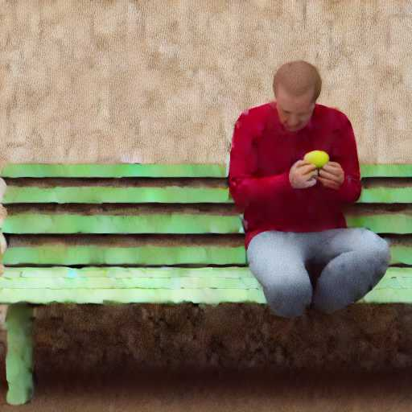
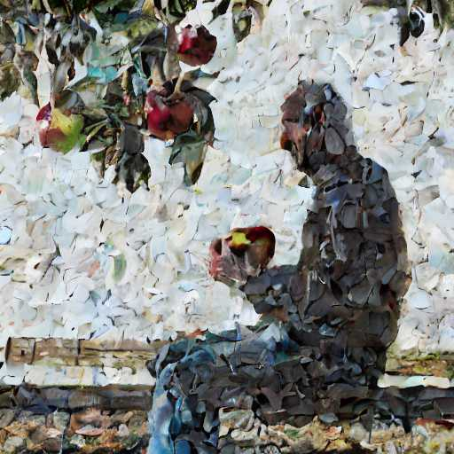
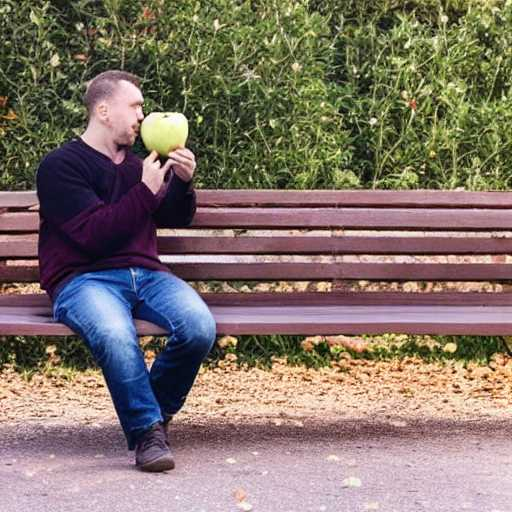
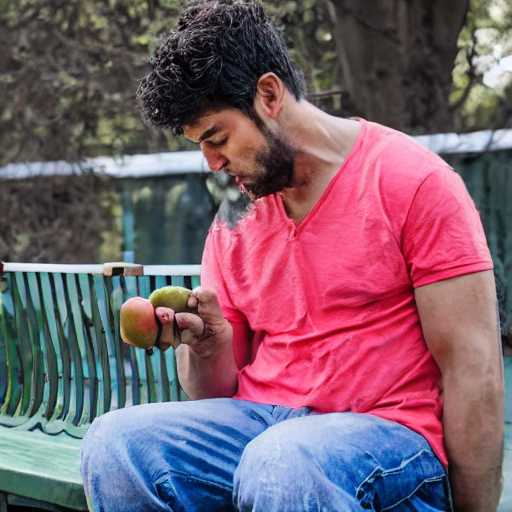
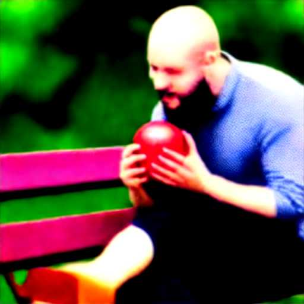

# diffusion for beginners

- implementation of _diffusion schedulers_ (currently sampling only) with minimal code & as faithful to the original work as i could. most recent work reuse or adopt code from previous work and build on it, or transcribe code from another framework - which is great! but i found it hard to follow at times. this is an attempt at simplifying below great papers. the trade-off is made between stability and correctness vs. brevity and simplicity. 

- [x] [ddpm](samplers/ddpm.py) (ho et al. 2020), denoising diffusion probabilistic models, https://arxiv.org/abs/2006.11239
- [x] [improved ddpm](samplers/ddpm.py) (nichol and dhariwal 2021), improved denoising diffusion probabilistic models,https://arxiv.org/abs/2102.09672
- [x] [ddim](samplers/ddim.py) (song et al. 2020), denoising diffusion implicit models, https://arxiv.org/abs/2010.02502
- [x] [pndm](samplers/pndm.py) (ho et al. 2020), pseudo numerical methods for diffusion models, https://arxiv.org/abs/2202.09778
- [x] [heun](samplers/heun.py) (karras et al. 2020), elucidating the design space of diffusion-based generative models, https://arxiv.org/abs/2206.00364
- [x] [dpm-solver](samplers/dpm_solver.py) (lu et al. 2022), dpm-solver: a fast ode solver for diffusion probabilistic model sampling in around 10 steps, https://arxiv.org/abs/2206.00927


**prompt**: "a man eating an apple sitting on a bench"

<table>
 <tr>
    <td></td>
    <td></td>
 </tr>
 <tr>
   <td><b style="font-size:20px">ddpm</b></td>
   <td><b style="font-size:20px">improved ddpm</b></td>
 </tr>
</table>


<table>
 <tr>
    <td></td>
    <td></td>
 </tr>
 <tr>
   <td><b style="font-size:20px">ddim</b></td>
   <td><b style="font-size:20px">pndm</b></td>
 </tr>
</table>


<table>
 <tr>
    <td></td>
    <td></td>
 </tr>
 <tr>
   <td><b style="font-size:20px">heun</b></td>
   <td><b style="font-size:20px">dpm-solver</b></td>
 </tr>
</table>


### * requirements *
while this repository is intended to be educational, if you wish to run and experiment, you'll need to obtain a [token from huggingface](https://huggingface.co/docs/hub/security-tokens) (and paste it to generate_sample.py), and install their excellent [diffusers library](https://github.com/huggingface/diffusers)


### * modification for heun sampler * 
heun sampler uses two neural function evaluations per step, and modifies the input as well as the sigma. i wanted to be as faithful to the paper as much as possible, which necessitated changing the sampling code a little.
initiate the sampler as:
```python
sampler = HeunSampler(num_sample_steps=25, denoiser=pipe.unet, alpha_bar=pipe.scheduler.alphas_cumprod)
init_latents = torch.randn(batch_size, 4, 64, 64).to(device) * sampler.t0
```

and replace the inner loop for generate_sample.py as:
```python
for t in tqdm(sampler.timesteps):
    latents = sampler(latents, t, text_embeddings, guidance_scale)
```

similarly, for dpm-solver-2, 

```python
    sampler = DPMSampler(num_sample_steps=20, denoiser=pipe.unet)
    init_latents = torch.randn(batch_size, 4, 64, 64).to(device) * sampler.lmbd(1)[1]
```

## soft-diffusion

a sketch/draft of google's new paper, [soft diffusion: score matching for general corruptions](https://arxiv.org/abs/2209.05442), which achieves state-of-the-art results on celeba-64 dataset.

details can be found [here](soft_diffusion)