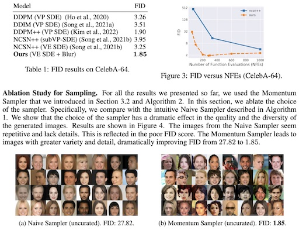

# Soft Diffusion: Score Matching for General Corruptions

[arxiv link to paper](https://arxiv.org/abs/2209.05442)

sketch of google's new paper, which achieves state-of-the-art results on celeba-64 dataset.

this implementation is missing some details & involves some guesswork

because the paper did not define certain variables and implementation details in its current version (v2).